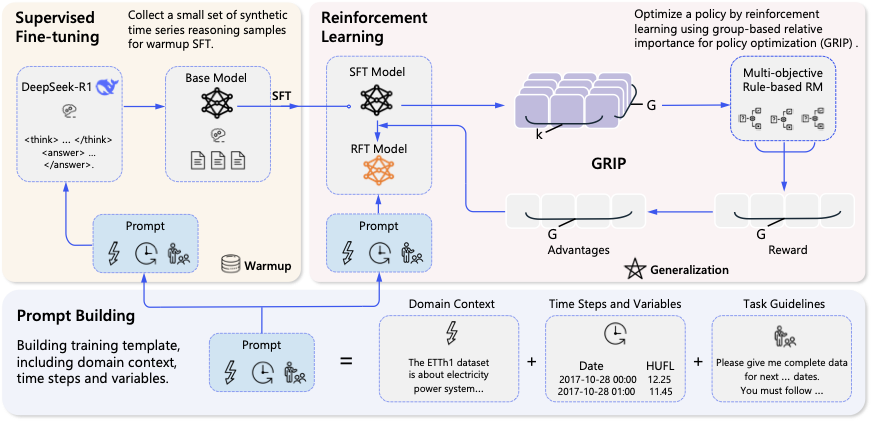
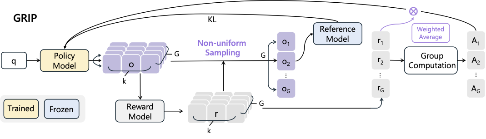

<div align="center">
<h1>
Time Series Forecasting as Reasoning: A Slow-Thinking Approach with Reinforced LLMs
</h1>
</div>


<div align="center">
  <a href="https://huggingface.co/ustc-zyt/Time-R1">
    🤗 <strong>Model (Time-R1)</strong>
  </a> |
  <a href="https://huggingface.co/datasets/ustc-zyt/time-r1-data">
    📊 <strong>Train and Eval Dataset</strong>
  </a> |
  <a href="https://arxiv.org/">
    📖 <strong>Paper</strong>
  </a>
  <br><br>
  
  
  
  
</div>


## 📖 Abstract
**Time-R1 introduces the study of slow-thinking reasoning for time series forecasting. We propose a two-stage reinforcement fine-tuning framework combining supervised warmup and policy optimization with GRIP, a group-based sampling strategy for multi-step reasoning. Our model significantly improves forecasting accuracy across diverse datasets, demonstrating the effectiveness of training LLMs for structured temporal reasoning.**

This repository contains the official code for our [paper](https://arxiv.org/):
> **Time Series Forecasting as Reasoning: A Slow-Thinking Approach with Reinforced LLMs** > Yucong Luo,
Yitong Zhou,
Mingyue Cheng,
Jiahao Wang,
Daoyu Wang,
Jintao Zhang,
Tingyue Pan  

## Updates/News:

🚩 **News** (Jun. 2025): The final version of the paper was polished and successfully submitted to [arXiv](https://arxiv.org/).

🚩 **News** (May 2025): The **Time-R1 repository** was officially released and fully open-sourced on GitHub.


## 🌟 Overview

<div align="center">

<p><em>Overview of the Time-R1.</em></p>
</div>

Large Language Models (LLMs) demonstrate impressive capabilities but often lack time series reasoning for forecasting tasks. **Ours** addresses this by introducing a novel **two-stage reinforcement fine-tuning (RFT) curriculum**, guided by a custom-designed **multi-objective reward framework** that explicitly shapes temporal reasoning. Our approach progressively develops:  
1. **(Stage 1: SFT for Warmup Adaption)** Foundational skills through supervised fine-tuning, where LLMs learn temporal analysis using synthetic CoT data, ensuring proper structure and formatting.  
2. **(Stage 2: RL for Exploring Effective Reasoning Patterns)** Advanced forecasting via RL, with rewards based on ground truth alignment, multi-horizon accuracy, and domain principles. **GRIP** (Group-based Relative Importance for Policy Optimization) enhances reasoning paths through non-uniform sampling and adaptive weighting.

<div align="center">

<p><em>GRIP Optimization Framework.</em></p>
</div>

Experiments show that Time-R1 significantly improves forecasting accuracy and generalization across multiple real-world datasets.


## 📚 Released Resources

* **[Training Dataset](https://huggingface.co/datasets/ustc-zyt/time-r1-data):** 
    * Preparing training and evaluating datasets.
* **[Time-R1 Model Checkpoints](https://huggingface.co/ustc-zyt/Time-R1):**
    * The final model after two-stage RFT.
* **[Source Code](https://github.com/lqzxt/Time-R1):** 
  * For training Time-R1 and evaluating.


## ⚙️ Key Features

*   **Slow-Thinking Time Series Reasoning:** Trains LLMs to perform deliberate, step-by-step temporal analysis for forecasting tasks.  
*   **Two-Stage RFT Framework:** Combines warm-up supervised fine-tuning (SFT) with reinforcement learning (RL) for progressive capability building.  
*   **GRIP: Group-based Reward Optimization:** Introduces non-uniform sampling and adaptive weighting to enhance reasoning path exploration and model robustness.  
*   **Fine-Grained Multi-Objective Rewards:** Designed to improve temporal coherence, multi-horizon accuracy, and alignment with domain-specific forecasting principles.  
*   **Strong Forecasting Performance:** Extensive experiments on real-world datasets demonstrate significant improvements over baseline methods through the slow-thinking paradigm.


## 🚀 Quick Start
### Installation

We recommend using **Python 3.10+** and setting up a clean environment via `conda`, with system pre-requisites including **CUDA ≥ 12.4** and **cuDNN ≥ 9.8.0** before training or inference.
 * **CUDA**: Version ≥ **12.4**
 * **cuDNN**: Version ≥ **9.8.0**

```bash
conda create -n time-r1 python==3.10
conda activate time-r1

git clone https://github.com/lqzxt/Time-R1.git

# Install verl framework
cd Time-R1
pip install --no-deps -e .
pip install -r requirements.txt
```

## 🛠️ Training
### Time-R1 RL Training
```bash
# Run training
bash scripts/time-r1.sh
```


## 📈 Evaluation
```bash
cd Time-R1/eval
python main.py
```

## 🙏Acknowledgements
* 🧠 [**Verl**](https://github.com/volcengine/verl): A flexible and efficient RLHF framework used for reinforcement learning with GRIP.
* 🦙 [**LLaMA Factory**](https://github.com/hiyouga/LLaMA-Factory): Streamlined interface for supervised fine-tuning and RLHF on open LLMs.
* 🔢 [**Qwen2.5 Models**](https://huggingface.co/Qwen): Open-source LLMs that serve as our forecasting backbone.
* 🔧 [**vLLM**](https://github.com/vllm-project/vllm): High-throughput LLM inference engine used during RL rollout.
<!-- ## Citation
If you find Time-R1 useful in your research, please cite our paper: 

```bibtex
@article{

}
``` -->
