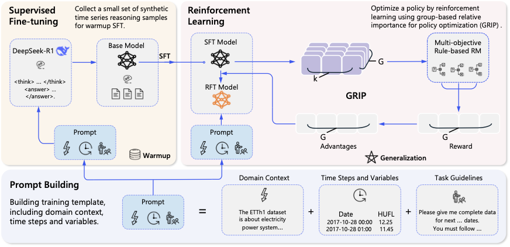
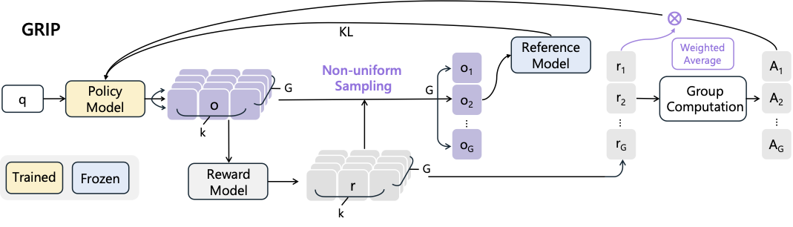

<div align="center">
<h1>
Time Series Forecasting as Reasoning: A Slow-Thinking Approach with Reinforced LLMs
</h1>
</div>

## 📖 Abstract
**Time-R1 introduces the study of slow-thinking reasoning for time series forecasting. We propose a two-stage reinforcement fine-tuning framework combining supervised warmup and policy optimization with GRIP, a group-based sampling strategy for multi-step reasoning. Our model significantly improves forecasting accuracy across diverse datasets, demonstrating the effectiveness of training LLMs for structured temporal reasoning.**

This repository contains the official code for the paper:
> **Time Series Forecasting as Reasoning: A Slow-Thinking Approach with Reinforced LLMs**

## 🌟 Overview

<div align="center">

<p><em>Overview of the Time-R1.</em></p>
</div>

Large Language Models (LLMs) demonstrate impressive capabilities but often lack time series reasoning for forecasting tasks. **Ours** addresses this by introducing a novel **two-stage reinforcement fine-tuning (RFT) curriculum**, guided by a custom-designed **multi-objective reward framework** that explicitly shapes temporal reasoning. Our approach progressively develops:  
1. **(Stage 1: SFT for Warmup Adaption)** Foundational skills through supervised fine-tuning, where LLMs learn temporal analysis using synthetic CoT data, ensuring proper structure and formatting.  
2. **(Stage 2: RL for Exploring Effective Reasoning Patterns)** Advanced forecasting via RL, with rewards based on ground truth alignment, multi-horizon accuracy, and domain principles. **GRIP** (Group-based Relative Importance for Policy Optimization) enhances reasoning paths through non-uniform sampling and adaptive weighting.

<div align="center">

<p><em>GRIP Optimization Framework.</em></p>
</div>

Experiments show that Time-R1 significantly improves forecasting accuracy and generalization across multiple real-world datasets.

## 📚 Resources

* **Training Dataset:** Scripts and configurations for preparing training and evaluating datasets are provided.
* **Time-R1 Model:** The codebase supports the training and inference of the Time-R1 model after two-stage RFT.
* **Source Code:** Complete source code for training and evaluation.

## ⚙️ Key Features

* **Slow-Thinking Time Series Reasoning:** Trains LLMs to perform deliberate, step-by-step temporal analysis for forecasting tasks.  
* **Two-Stage RFT Framework:** Combines warm-up supervised fine-tuning (SFT) with reinforcement learning (RL) for progressive capability building.  
* **GRIP: Group-based Reward Optimization:** Introduces non-uniform sampling and adaptive weighting to enhance reasoning path exploration and model robustness.  
* **Fine-Grained Multi-Objective Rewards:** Designed to improve temporal coherence, multi-horizon accuracy, and alignment with domain-specific forecasting principles.  
* **Strong Forecasting Performance:** Extensive experiments on real-world datasets demonstrate significant improvements over baseline methods through the slow-thinking paradigm.

## 🚀 Quick Start
### Installation

We recommend using **Python 3.10+** and setting up a clean environment via `conda`, with system pre-requisites including **CUDA ≥ 12.4** and **cuDNN ≥ 9.8.0** before training or inference.
 * **CUDA**: Version ≥ **12.4**
 * **cuDNN**: Version ≥ **9.8.0**

```bash
conda create -n time-r1 python==3.10
conda activate time-r1

# Install verl framework
cd Time-R1
pip install --no-deps -e .
pip install -r requirements.txt
```

## 🛠️ Training
### Time-R1 RL Training
```bash
# Run training
bash scripts/time-r1.sh
```


## 📈 Evaluation
```bash
cd Time-R1/eval
python main.py
```

